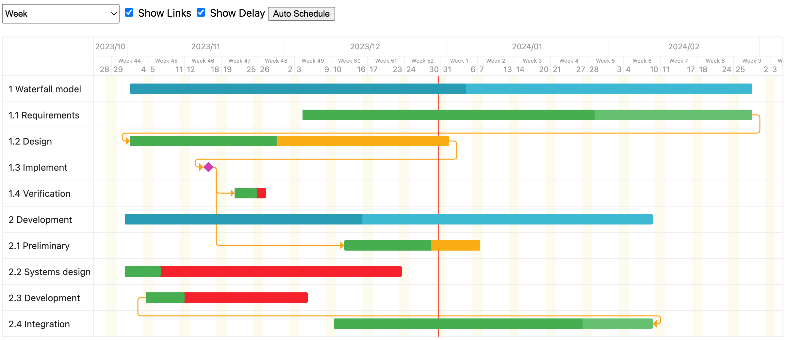

Gantt chart web component
===========

> Port of https://github.com/d-band/gantt to Typescript and Lit web component

## Install

```bash
$ npm install wc-gantt --save
```

## Usage

[View demo online](https://a-maiorov.github.io/wc-gantt/)



## WcGantt

### Custom html element
```html
  <wc-gantt></wc-gantt>
```

### Public reactive properties
```typescript
  @property({ type: Object, attribute: false })
  options: WcGanttOptions;

  @property({ type: Array, attribute: false })
  data: Item[];
```
### Events
```typescript
 "before-link-added" : CustomEvent<LinkAddedEvArgs>

 "item-click": CustomEvent<Item>
```

## Types

```typescript
interface Link {
  source: string | number;
  target: string | number;
  type: LinkType;
}

type LinkType = "FS" | "FF" | "SS" | "SF";
type ItemType = "activity" | "group" | "milestone";

interface Item {
  id: unknown;
  path: string;
  type?: ItemType;
  nested?: Item[];
  text: string;
  start: Date;
  end: Date;
  percent?: number;
  links?: Array<Link>;
} 
interface Activity extends Item {
  type: "activity";
  nested: undefined;
} 
interface Milestone extends Item {
  type: "milestone";
  nested: undefined;
  percent: undefined;
} 
interface Group extends Item {
  type: "group";
  nested: Item[];
}

interface WcGanttOptions {
  viewMode: "day" | "week" | "month";
  offsetY: number; // default: 60,
  rowHeight: number; // default: 40,
  barHeight: number; // default: 16,
  maxTextWidth?: number;
}

interface ComponentSettings extends WcGanttOptions {
  thickWidth: number; // default: 1.4 - defined by --gantt-layout-thick-line-stroke-width CSS var
  start: Date;
  end: Date;
  data: Item[];
}

type LinkAddedEvArgs = {
  link: Link;
  cancel: () => void;
};
```

## CSS Variables
```css
:host {
    --gantt-milestone-color: #d33daf;
    --gantt-bar-back-fill: #65c16f;
    --gantt-bar-warning-back-fill: #faad14;
    --gantt-bar-danger-back-fill: #f5222d;
    --gantt-bar-front-fill: #46ad51;
    --gantt-bar-group-back-fill: #3db9d3;
    --gantt-bar-group-front-fill: #299cb4;
    --gantt-bar-today-line-stroke: #f04134;
    --gantt-bar-today-line-stroke-width: 1px;

    --gantt-link-line-hover-stroke-width: 2.5;
    --gantt-link-line-stroke: #ffa011;
    --gantt-link-line-stroke-width: 1.5px;

    --gantt-active-ctl-fill: #ffbf5e;
    --gantt-active-ctl-stroke: #ffa011;
    --gantt-inactive-ctl-fill: #f0f0f0;
    --gantt-inactive-ctl-stroke: #929292;
    --gantt-ctl-stroke-width: 1px;
 
    --gantt-chart-bg-color: #fff;
    --gantt-layout-line-stroke: #eee;
    --gantt-layout-line-stroke-width: 1px;
    --gantt-layout-thick-line-stroke-width: 1.4px;
    --gantt-layout-text-fill: #222;
    --gantt-layout-font-size: 14px;
    --gantt-layout-small-text-fill: #999;
    --gantt-layout-small-font-size: 12px;
    --gantt-layout-tiny-text-fill: #999;
    --gantt-layout-tiny-font-size: 8px;
    --gantt-day-header-weekend-fill: rgba(252, 248, 227, 0.6);
}
```

## License

wc-gantt is available under the terms of the MIT License.
